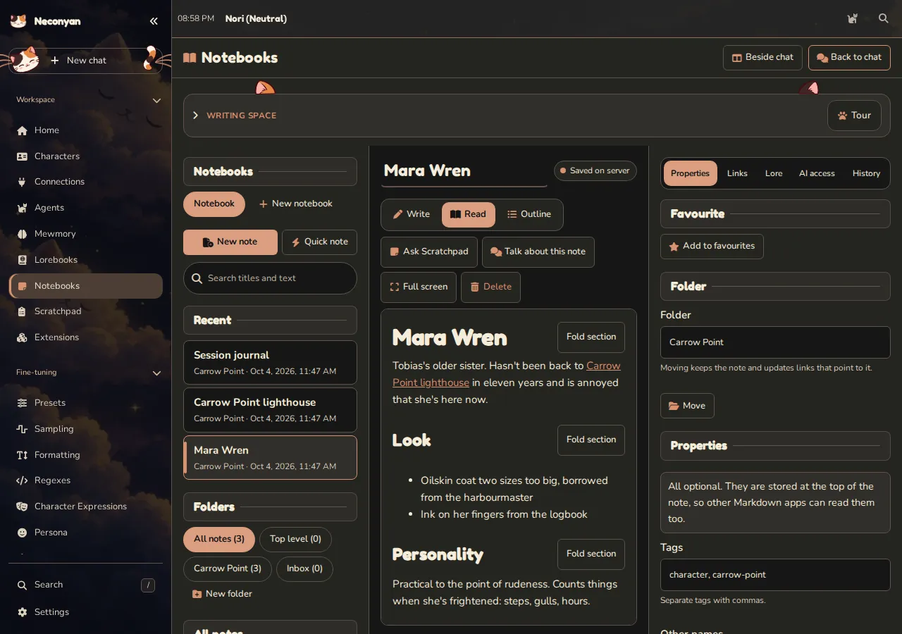
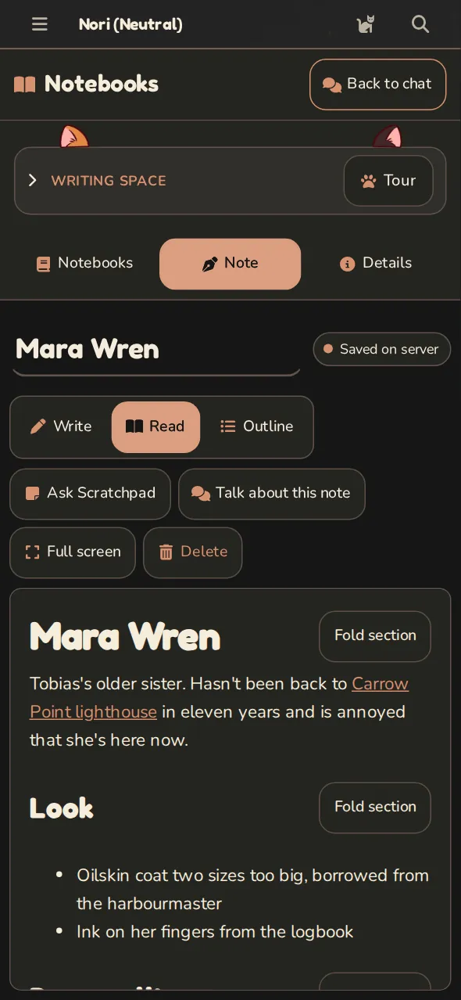

# Notebooks

Notebooks gives you a writing and reference workspace inside Neconyan. Use it for outlines, character research, drafts, files and linked notes. You don't need an open chat or a model connection to write.

=== "Computer"

    <figure class="screenshot" markdown>
    [](../assets/images/screenshots/desktop-notes.webp)
    <figcaption>A staged notebook. Desktop layouts can sit beside the chat or use the full width.</figcaption>
    </figure>

=== "Phone"

    <figure class="screenshot screenshot--phone" markdown>
    [](../assets/images/screenshots/phone-notes.webp)
    <figcaption>Phone tabs separate the notebook list, current note and details.</figcaption>
    </figure>

## Create and save a note

1. Open **Notebooks** in the workspace.
2. Choose **New notebook** for a collection, or start in **Inbox**.
3. Use **New note**, a template or **Quick note** to begin writing.

**Write** edits Markdown, plain text with simple formatting marks. **Read** shows the formatted result. **Outline** helps you navigate headings. On a phone, use the Notebooks, Note and Details tabs; **Back to chat** returns to the conversation.

Watch the save status:

| Status | What it means |
| --- | --- |
| **Saved on server** | The server has accepted the saved version |
| **Saving** | The save hasn't finished |
| **Saved on this device only** | A local copy exists, but server saving hasn't been confirmed |
| **Conflict** | Another saved version needs your attention |
| **Could not save** | Read the error and keep a copy of important text |

You can use ++ctrl+s++ or ++cmd+s++ to save. A browser-local recovery copy is useful, but it isn't an independent backup.

## Resolve a conflict

If another device or action changed the note, use **Compare**. Choose **Use server version**, **Save mine as a copy** or **Keep mine** according to which text you want. Don't replace a newer version until you've compared it.

History and Trash help recover earlier work. Export important notebooks separately as part of your backup routine.

## Organise and link

Properties hold tags, aliases, a note type and custom fields. Use folders and clear titles to keep related work findable. Links such as these connect notes within a notebook:

```markdown
[[Glassmarket Station]]
[[Places/Glassmarket Station|the station]]
![[Scene outline]]
```

The graph shows saved note links. The property table filters and sorts fields such as tags or note type. JSON Canvas files let you arrange notes and connections visually; use **Save canvas** to save those edits.

Markdown and supported canvas content can move between Neconyan and compatible tools such as Obsidian. Neconyan doesn't run Obsidian plugins.

## Decide what an assistant can read

Notebook AI permissions begin at **Nothing**. Other choices are **Read** and **Read and suggest edits**, with notebook, note and temporary sharing controls.

**Talk about this note** copies the current note into a chosen Roleplay or Conversation draft. It doesn't send it. Review the composer before sending.

**Ask Scratchpad** opens a note-specific side discussion with temporary access to the shared note or selection. Preview the exact text first. Linked notes, the open story, the character and your persona aren't automatically added to that note-only discussion.

!!! taro "Taro"
    A link makes a note easier to find. It doesn't grant permission to read it. This is one of the rare occasions where the boring distinction is the important one.

## Review suggested edits

An assistant proposal appears as **Not saved yet**. Review the current and proposed text, then choose **Save change**, **Not now** or **Decline** where offered.

The setting **Allow assistants to save changes I request** can permit direct saves for eligible notebook actions during a limited period. Scratchpad proposals still require review, and lore publication still requires its own approval. Don't assume one permission changes every writing tool.

## Notes as reference or lore

Reference use is separate from assistant editing permissions. **Not used** is the default; **Available as reference** allows relevant sections, and **Pinned** includes the whole note when it fits. Use **Preview for this chat** to check what would be included.

**Use as lore** publishes a note or section into a lorebook entry. Merely associating a notebook with a book doesn't publish its contents. Check that the book is attached and enabled for the intended chat afterwards. Sections already published as lore are excluded from note reference selection to avoid duplication.

## Import and export

Export a notebook, folder or selected notes as Markdown in a ZIP. The export doesn't include revision history, AI permissions or lore bindings. Importing supported Markdown or ZIP content creates a separate notebook with private defaults, rather than silently granting its notes to assistants.

For files, advanced properties, canvas details and optional Obsidian Headless support, read the [full notebook reference](https://github.com/platberlitz/Neconyan/blob/staging/docs/notebooks.md).
