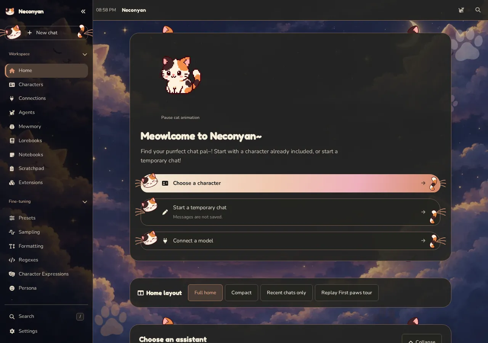
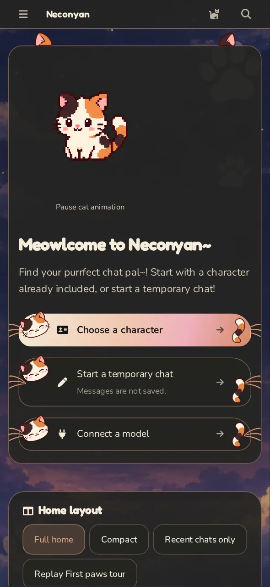

The Neconyan handbook

# Make yourself at home.

Get your first character reply with a little help from Neconyan's cat assistants. We'll explain the settings as you need them.

[Take your first paws](start/index.md){ .md-button .md-button--primary }
[Find your way around](workspace/index.md){ .md-button }

  <figure><figcaption><strong>Miso</strong>Getting you settled · they/them</figcaption></figure>
  <figure><figcaption><strong>Taro</strong>Sorting things out · they/them</figcaption></figure>
  <figure><figcaption><strong>Nori</strong>Plotting something · they/them</figcaption></figure>

## What would you like to do?

[**Get my first reply** Set up Neconyan and start a chat.](start/index.md)
[**Bring my characters over** Import your existing library.](start/imports.md)
[**Try a different kind of chat** Roleplay, direct messages, a private timeline or a manuscript.](workspace/index.md)
[**Plan the next scene** Keep an outline or discuss an idea in Scratchpad.](helpers/index.md)
[**Fix something** Connections, missing chats, slow replies and phone access.](help/troubleshooting.md)

!!! miso "Miso"
    You only need one working model connection and one character to begin. We can leave the elaborate setup until you've actually had some fun.

## A quick look inside

Neconyan is a self-hosted app for character chat and writing. It runs on your computer, your own server or an Android device, and you open it in a browser or the Android app. You choose the model that writes the replies, through an online provider or a model running on your own hardware.

=== "On a computer"

    <figure class="screenshot" markdown>
    
    <figcaption>Home gives you a starting point for your next chat. Select a screenshot to enlarge it.</figcaption>
    </figure>

=== "On a phone"

    <figure class="screenshot screenshot--phone" markdown>
    
    <figcaption>Home with compact phone navigation.</figcaption>
    </figure>

The screenshots use staged conversations with the bundled assistants. They're real app screens, with example content rather than someone's private chat history. See [about these docs](help/about.md) for the source version and credits.

## Meet your guides

**Miso** takes you through the first steps. **Taro** handles settings and the things that have stopped behaving. **Nori** helps develop characters and plot complications.

Open **Your guides** above to choose male, female or neutral for each of them. Their artwork and pronouns follow your choice throughout the handbook. Their advice stays useful. Taro's puns remain a separate problem.

!!! taro "Taro"
    Neconyan doesn't include model credits. Check your provider's charges before enabling extra helpers. The small print is now normal-sized print.

Already using Neconyan? Keep [the glossary](help/glossary.md) handy, or use the search at the top to jump straight to a feature.
