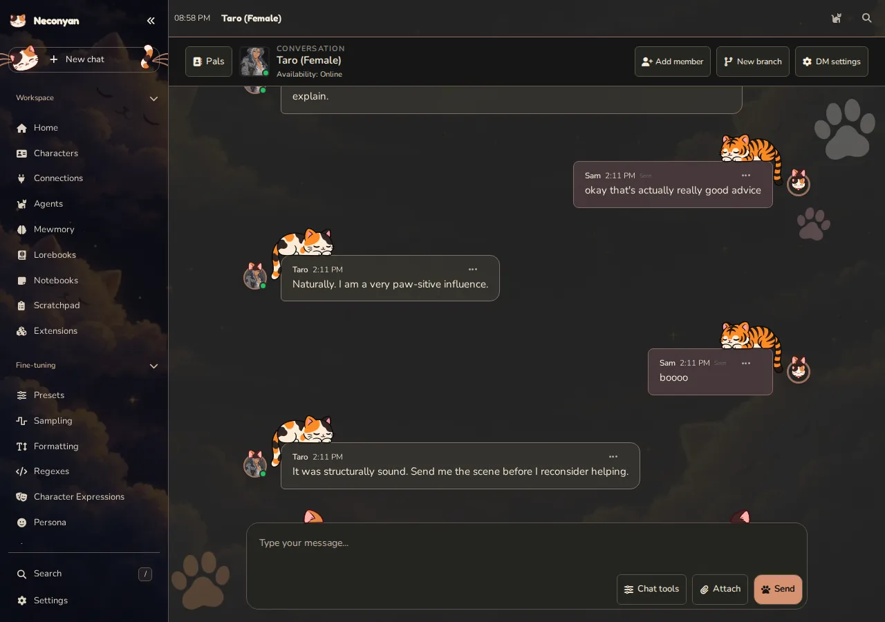
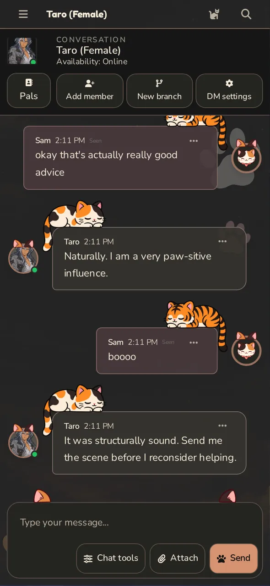

# Conversation

Conversation gives your characters a direct-message and group-chat space. It has separate histories, branches and memory from Roleplay, with messaging features such as replies, reactions, pins and schedules.

=== "Computer"

    <figure class="screenshot" markdown>
    
    <figcaption>A staged direct-message conversation, separate from the Roleplay transcript.</figcaption>
    </figure>

=== "Phone"

    <figure class="screenshot screenshot--phone" markdown>
    
    <figcaption>Conversation's messaging layout on a phone.</figcaption>
    </figure>

## Open or create a conversation

Switch an open character to **Conversation**, or open the mode through workspace navigation. **Pals** lists your conversations and offers **New Solo Chat** and **New Group Chat**.

Check your persona before starting. Histories and memories are associated with personas, so switching persona can make a familiar conversation appear different or absent without deleting it.

For a group, choose the members you want. Use **Add Member** later to expand the conversation. An **@Name** mention can prioritise who should respond.

## Message tools

The message menu offers actions such as Reply, Copy, Pin, Edit, Regenerate, Branch and Delete where applicable. A reply quotes or targets a message; a pin makes it easier to find again.

The tools area can filter the conversation into **Main**, **Pins**, **Selfies**, **Files**, **OOC** and **Memories**. OOC means out-of-character discussion. Files and pictures have their own views so they don't disappear into a long thread.

## New chat, branch or delete?

**New Chat** begins another branch while keeping the previous one. **Branch from here** copies the conversation up to the selected point so you can try another direction. A branch may also carry a memory summary; it isn't necessarily an empty mental reset.

Deleting history is a different operation. Read the confirmation rather than using Delete as a shortcut for starting fresh.

## Availability and schedules

Characters can have statuses, schedules and settings that affect when they respond. A delayed reply isn't always a failed model request. Check the conversation's settings and any availability information; **Force** can bypass the normal availability decision when offered.

Scheduled actions still depend on the Neconyan server running. Closing a page is different from shutting down the host or letting Android stop the app.

## Pictures and memory

Conversation pictures use your saved **Quick Image Gen** configuration. A working text connection doesn't configure image generation. Enable the relevant Conversation image setting, set up the image provider and check any image cooldown if a selfie doesn't appear.

Conversation's summaries and memories are separate from Roleplay's [Mewmory](../helpers/mewmory.md). A fact remembered in one mode isn't proof it was carried into the other.

!!! nori "Nori"
    Starting a new branch because I said something embarrassing is technically allowed. Calling it a research methodology is ambitious.

For the full control reference, see the [Conversation glossary in the app repository](https://github.com/platberlitz/Neconyan/blob/staging/docs/conversation-mode-glossary.md).
