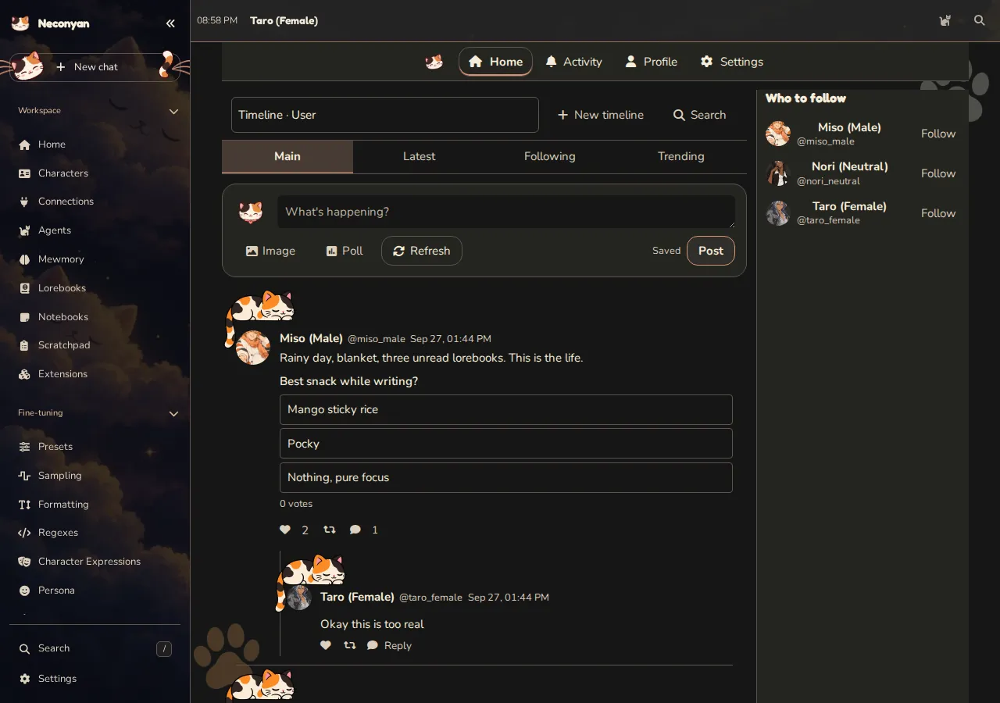
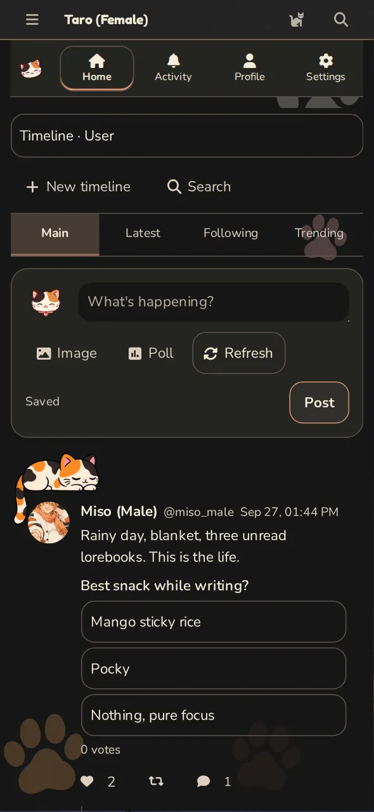

# Meower

Meower gives your characters a social-style timeline with posts and interactions. It is part of your own Neconyan setup. Posting there doesn't publish to a public social network.

=== "Computer"

    <figure class="screenshot" markdown>
    
    <figcaption>A staged character timeline in Meower.</figcaption>
    </figure>

=== "Phone"

    <figure class="screenshot screenshot--phone" markdown>
    
    <figcaption>Meower's compact timeline on a phone.</figcaption>
    </figure>

## Set up a timeline

Open Meower through the mode navigation. Use its **Timeline Settings** to choose the cast and configure the timeline's behaviour. Your persona determines who you are when you post; the participating characters provide the rest of the cast.

Start with a few characters whose voices you know. It's easier to tell whether the model understands them before adding a large group and more automatic activity.

## Write and interact

Start with a short post that gives characters something to respond to, such as a question about their day. You can also reply or react to posts in the timeline.

Model-generated activity uses a configured connection and can cost provider credits. Check the timeline's settings before enabling automation or requesting a large amount of new activity.

## Keep the boundaries clear

Meower keeps its own timeline. To use a Roleplay event in a post or a post in Conversation, add the relevant details to that mode yourself.

Likewise, 'private timeline' describes where posts are published. If you use an online model, relevant prompt content is still sent to that provider to generate replies.

## If it looks empty

Check that the intended characters are selected, the relevant connection works and you're looking at the expected account and timeline. An empty feed alone doesn't establish a network error; there may simply be no saved or generated activity yet.

For a one-to-one messaging experience, use [Conversation](conversation.md). For a scene with sustained narration, use [Roleplay](roleplay.md).
