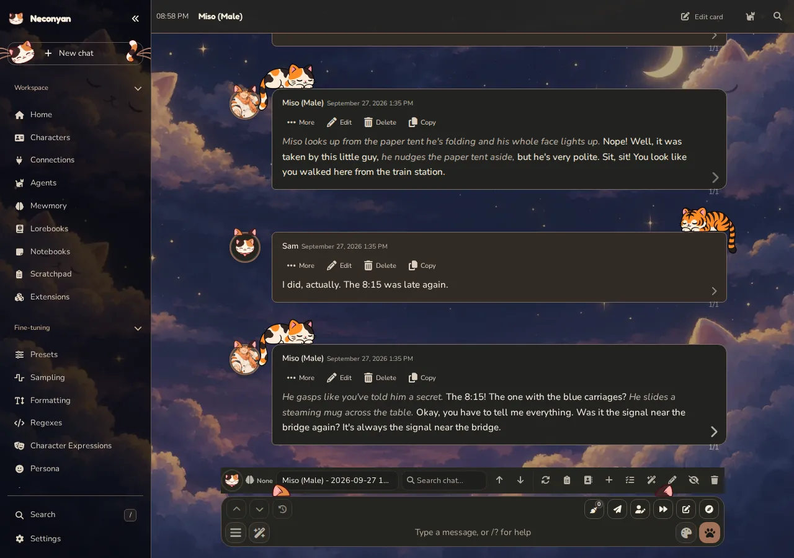
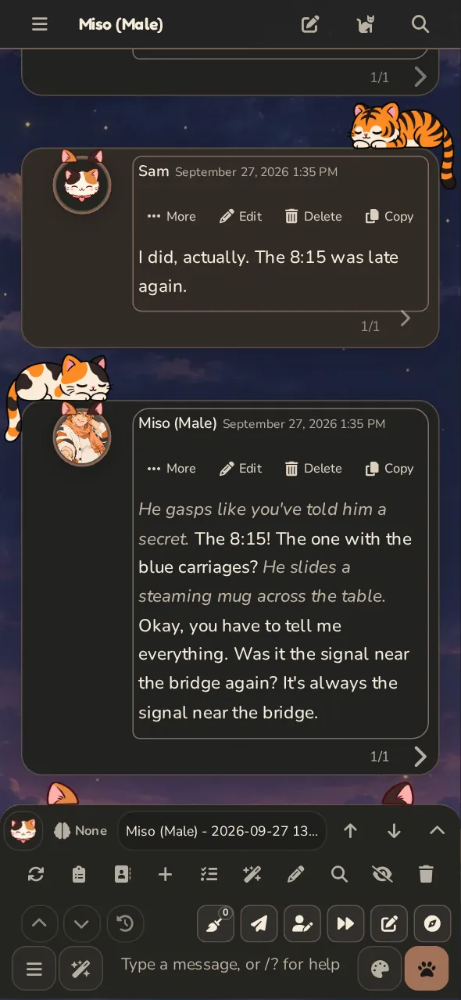

# Roleplay

In Roleplay, you exchange messages with a character to develop a scene. It suits both casual character chat and narrated stories.

=== "Computer"

    <figure class="screenshot" markdown>
    [](../assets/images/screenshots/desktop-roleplay.webp)
    <figcaption>A staged Roleplay conversation. Message controls act on the selected message or alternative.</figcaption>
    </figure>

=== "Phone"

    <figure class="screenshot screenshot--phone" markdown>
    [](../assets/images/screenshots/phone-roleplay.webp)
    <figcaption>The composer stays close to the conversation on a narrow screen.</figcaption>
    </figure>

## Start a scene

Open a character, select Roleplay and choose a saved chat or begin a new one. Check your selected persona, then write a reply that gives the character something concrete to respond to.

Your model may receive more than the visible messages: the card, persona, preset instructions, activated lore, Author's Note and enabled helpers can all contribute. If the writing ignores your intended tone, inspect the full prompt for conflicting instructions.

## Work with replies

**Regenerate or swipe** when you want an alternative. **Edit** when you want a specific correction. **Continue** where available asks the model to extend the current response rather than start a new exchange.

Selecting an existing swipe changes the current text. Generating a new one makes a model request. Read the selected version before continuing, especially if later events depend on a particular detail.

To compare saved swipes, click the swipe counter on a computer or long-press it on a phone. Each version appears as a card you can read in full, copy, branch into a new chat or delete. Choose a card, then **Show swipe** to put it in the chat. On an earlier reply the cards are for reading, copying and branching only.

With **Guided Regenerate** in the composer, type a direction first and the latest AI reply is replaced with one that follows it. An empty composer gives an ordinary regeneration. Use Guided Swipe instead when you want to keep the old reply as an alternative.

Avoid editing an old message while a generation is still relying on it. Stop the current work first and make your intended history clear.

## Chat and writing settings

**Settings → Chat & Writing** separates controls into **Chat & messages**, **Characters**, **Auto-swipe & auto-continue**, **Autocomplete** and **Fine-tuning**. Start with the drawer that matches the behaviour you want to change. Script controls live under Fine-tuning; appearance-only switches live under [Appearance](appearance.md).

For reopening and linking chats, use **Chat & messages → Chat window**. **Reopen your last chat** and **Chat links in address bar** are separate choices, initially off. A chat link refers to a chat on that installation and account; it isn't a public copy of the conversation.

You can also use **Copy chat link** in desktop Recent Chats, or open **Chat link settings** from the phone's chat tools.

## Formatting and scripts

**Fine-tuning → Formatting** groups controls into **Context & cleanup**, **Instruct template**, **System prompt**, **Reasoning** and **Reply controls**. Use the section for the request or reply behaviour you want to change. Instruct templates define message markers for supported local-model connections; Chat Completion prompt lists still belong to that connection's preset controls. **Tour** explains the page.

STscript, Neconyan's slash-command scripting language, can run commands from the composer while a reply is being written. These commands help coordinate it:

| Command | What it does |
| --- | --- |
| `/is-generating` | Returns whether a solo or group reply is being generated |
| `/wait-generation timeout=60000` | Waits up to 60 seconds for the current reply; returns false on timeout. Use `timeout=0` to wait indefinitely |
| `/stop` | Stops the current reply; `/generate-stop` is an alias |
| `/getinput` | Reads the existing composer draft without changing it |
| `/trigger` | Requests another reply without sending or clearing the draft |

Use a wait before triggering another reply when the current one may take time. **Stop script** cancels a script's wait. Checking and waiting don't request a reply; generating does.

From a Quick Reply or automation, this replaces the existing draft with uppercase text:

```text
/getinput | /upper | /setinput
```

Typing and submitting that script directly in the composer clears the submitted script before it runs, so it can't recover an earlier draft. `/trigger`, `/gen` and `/genraw` preserve text already in the composer. A failed submitted command is restored only if the composer is still empty, keeping text you've since typed.

## Keep the model informed

- Put stable character traits in the [character card](characters.md).
- Put relevant world facts in [lorebooks](lorebooks.md).
- Use an Author's Note for short guidance about the current scene or style.
- Use [Mewmory](../helpers/mewmory.md) when a long saved history needs structured recall.
- Use [Scratchpad](../helpers/scratchpad.md) for planning you don't want inserted as a story message.

Adding context uses space. More instructions aren't automatically better if they contradict each other or push useful history out of the request.

## When you leave the page

Most server-backed Roleplay work can finish after the browser disconnects. Reopening the chat lets the interface recover accepted work and saved results. The server and provider still need to be available; browser-only model or speech routes can require the page to stay open.

If a reply seems stuck, inspect its status before sending another. [Troubleshooting](../help/troubleshooting.md) explains the difference between slow preparation, a pending provider request and a failed connection.

!!! taro "Taro"
    A tracker displayed under a reply may be an Agent or Companion result. The main model didn't necessarily write it. Check which request you're actually diagnosing.

Prefer a messaging-app rhythm? Try [Conversation](conversation.md). Prefer uninterrupted prose? Try [Story Mode](story-mode.md).
