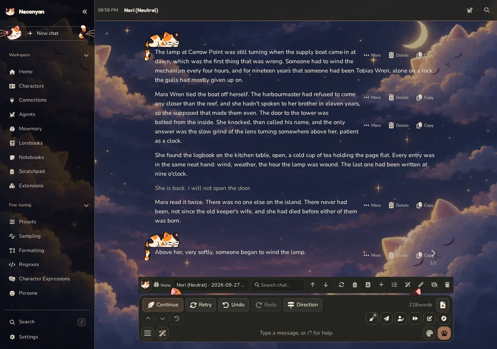
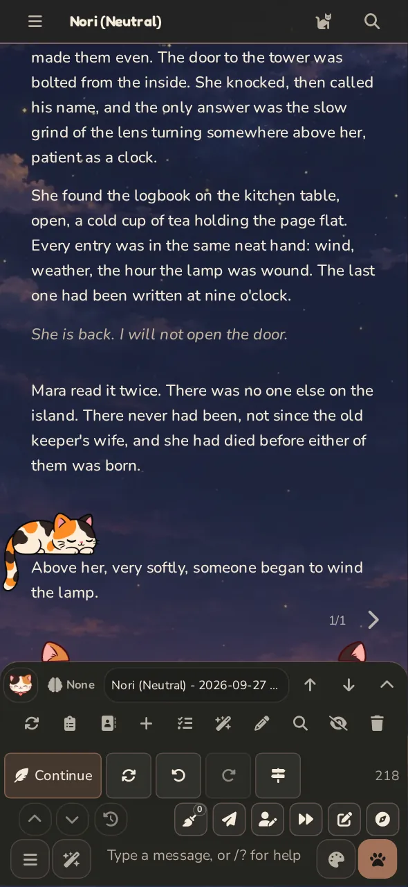

# Story Mode

Story Mode presents a saved chat as continuous manuscript-style writing. It is useful when you want to read or develop a scene without the ordinary message-bubble layout.

=== "Computer"

    <figure class="screenshot" markdown>
    
    <figcaption>A staged story shown in the manuscript view.</figcaption>
    </figure>

=== "Phone"

    <figure class="screenshot screenshot--phone" markdown>
    
    <figcaption>Continuous prose on a phone.</figcaption>
    </figure>

## Open the manuscript view

Open the chat you want to work on, then switch to **Story Mode** using the mode controls. Its preference is saved for that chat. Switching the presentation doesn't clear the draft you've typed.

The writing still belongs to the chat. Use the chat's export controls to keep a separate copy.

## Write for the format

Use the character, scenario and prompt instructions to establish viewpoint, tense and the kind of continuation you want. If you're asking for prose, be clear about whether the model should write only its character or contribute broader narration.

Make small edits when you know the desired wording. Generate a different continuation when you want another possibility. Check that the selected message alternative is the one you intend to carry forward.

## Keep planning outside the manuscript

[Scratchpad](../helpers/scratchpad.md) is useful for discussing pacing or the next scene without adding planning messages to the story. [Notebooks](../helpers/notebooks.md) can hold an outline, character notes and reference material.

If a stable world detail should reach the writing model when relevant, publish or write it into a [lorebook](lorebooks.md). A note sitting open beside the manuscript isn't automatically included in a model request.

!!! miso "Miso"
    Before a big rewrite, export the chat or save a copy of the passage you like. Future-you deserves something kinder than 'I'm sure I remember the good version'.

To return to the usual message controls and transcript, switch back to [Roleplay](roleplay.md).
